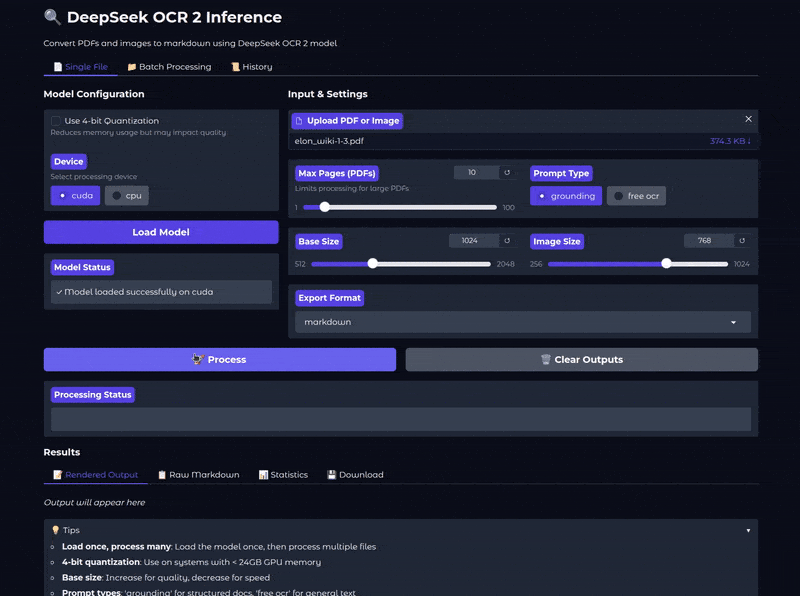

# DeepSeek OCR 2 Document Processing

A document OCR pipeline that converts PDF files to markdown using the DeepSeek OCR 2 model. The system extracts text and structure from document images and outputs structured markdown files.



## Features

- **PDF to Image Conversion**: Automatically converts PDF pages to JPEG images
- **Advanced OCR**: Uses DeepSeek OCR 2 model with 4-bit quantization for efficient processing
- **Markdown Output**: Converts document images to structured markdown format
- **Multi-Page Processing**: Processes multiple pages and merges results into a single markdown file

## Requirements

- Python 3.12+
- NVIDIA GPU with CUDA support

## Installation

### Clone the Repository
```bash
git clone https://github.com/sovit-123/deepseek_ocr_2_inference.git
cd deepseek_ocr_2_inference
```

### Install Python Dependencies
```bash
pip install -r requirements.txt
```

## Usage

### Basic Usage

Run OCR on PDF file.

```bash
python run.py <path/to/pdf>
```

Run OCR on image file.

```
python run.py --image <path/to/image>
```

Run OCR on a certain number of pages in the PDF.

```
python run.py <path/to-your/pdf> --max-pages 3
```

Load model with INT4 quantization using BitsAndBytes

```
python run.py <path/to-your/pdf> --int4
```

Choose between "grounding" (which creates structured markdown with images) [default is "grounding"] and "free ocr" which just extracts text.

```
python run.py <path/to-your/pdf> --prompt "grounding"
```

```
python run.py <path/to-your/pdf> --prompt "free ocr"
```

### Output Structure

```
outputs/
├── <document_name>/
│   ├── merged_output.md          # Combined markdown of all pages
│   ├── page_0/
│   │   ├── result.mmd           # Page 0 markdown
│   │   └── images/              # Page 0 extracted images
│   ├── page_1/
│   │   ├── result.mmd
│   │   └── images/
│   └── ...
```

## Project Structure

```
.
├── run.py                    # Main script
├── requirements.txt          # Python dependencies
├── .gitignore              # Git ignore rules
├── images/                 # Input images directory
├── outputs/                # Output results directory
└── input/                  # Input directory
```

## How It Works

1. **PDF Conversion**: Converts each page of the PDF to a JPEG image
2. **Inference**: Runs DeepSeek OCR 2 model on each image with quantization
3. **Markdown Generation**: Converts document content to markdown format
4. **Merging**: Combines individual page markdowns into a single output file with correct image path references

## Performance Notes

- Model is loaded with 4-bit quantization to reduce memory usage
- Flash Attention 2 is used for faster inference
- GPU memory usage: ~6GB (with quantization)
- Processing speed: ~30 seconds -1 minute per page depending on document complexity

## License

Please check the license of the DeepSeek model and included dependencies.

## References

- [DeepSeek OCR 2](https://huggingface.co/deepseek-ai/DeepSeek-OCR-2)
- [Transformers Documentation](https://huggingface.co/docs/transformers)
